UPenn Masterclass: Spatial Data Visualization with R
================
<span style="font-size:20px">James Cheshire (@spatialanalysis), University College London</span><br><br><span style="font-size:14px">[Spatial.ly](http://spatial.ly/)<br>[Master of Urban Spatial Analytics - University of Pennsylvania](https://www.design.upenn.edu/musa/about)</span>

Introduction
============

This worksheet will detail a number of approaches we can take to visualizing an open dataset hosted by the Socrata platform. Our specific focus is the city of Chicago, which has a very comprehensive open data platform (<https://data.cityofchicago.org/>). We will cover the following:

1.  Data download using the `RSocrata` package.
2.  Loading and formatting spatial layers with `sf`.
3.  Creating and tweaking maps with `ggplot2`.

The steps below are designed to race through to visualizing the data - they aren't a perfect or robust analysis of the datasets used so please don't use them as such!

Package installation and data download
======================================

This worksheet requires the following packages:

``` r
#if not all the following are already installed used the install.packages() syntax
library(RSocrata)
library(ggplot2)
library(sf)
library(tidyverse)
library(RANN)
library(hexbin)
library(mapproj)

#Now's a good time to create a new folder entitled "masterclass" and then set it as your working directory.

setwd("C:/Users/sgoldstein/Documents/masterclass")
```

Next we can get started with the data download. The `RSocrata` package offers an easy way to download tabular data direct from a Socrata website and has the additional benefits of correctly formatting times and dates. We will use this for the road traffic accident dataset. You'll see we first specify the url of the dataset's landing page and then use the `read.socrata` function to pull the data in. Be patient, this may take a few seconds. If you get a timeout message try again.

``` r
#Data url
accident_url<- "https://data.cityofchicago.org/Transportation/Traffic-Crashes-Crashes/85ca-t3if"

#Read in the data
accident_in<- read.socrata(accident_url)
```

If you look at the `head` of the file, you'll see there's a good number of columns that detail the accidents including their location, cause and the weather conditions at the time. Each accident has its own row so this is a large file that we should reduce down to have things run more quickly for now.

``` r
head(accident_in)
```

| alignment          | beat_of_occurrence |         crash_date  | crash_date_est_i | crash_day_of_week | crash_hour | crash_month | crash_type             | damage        | date_police_notified | device_condition     | dooring_i | first_crash_type         | hit_and_run_i | injuries_fatal | injuries_incapacitating | injuries_no_indication | injuries_non_incapacitating | injuries_reported_not_evident | injuries_total | injuries_unknown | intersection_related_i | lane_cnt | latitude | lighting_condition     | location                                 | longitude | most_severe_injury      | num_units photos_taken_i | posted_speed_limit | prim_contributory_cause       |
| ------------------ | ------------------ | ------------------- | ---------------- |------------------ | ---------- | ----------- |----------------------- | ------------- | -------------------- | -------------------- | --------- | ------------------------ | ------------- | -------------- | ----------------------- | ---------------------- | --------------------------- | ----------------------------- | -------------- | ---------------- | ---------------------- | -------- | -------- | ---------------------- | ---------------------------------------- | --------- | ----------------------- | ------------------------ | ------------------ | ----------------------------- |
| STRAIGHT AND LEVEL |              1033  | 2016-04-16 05:49:00 | 1                | 7                 | 5          | 4           | NO INJURY / DRIVE AWAY |  OVER $1,500   | 2016-04-16 06:30:00  | FUNCTIONING PROPERLY | <NA>      | SIDESWIPE SAME DIRECTION | Y             | 0              | 0                       | 2                      | 0                           | 0                             | 0              | 0                |        Y               | 0        | 41.84473 | DAWN                   | POINT (-87.695363066709 41.844733938666) | -87.69536 | NO INDICATION OF INJURY | 2                        |  30                 | IMPROPER LANE USAGE           |
| STRAIGHT AND LEVEL |              1135  | 2016-10-24 02:42:00 | 2                | 2                 | 2          | 10          | NO INJURY / DRIVE AWAY | $501 - $1,500 | 2016-10-24 02:43:00  | NO CONTROLS          | <NA>      | SIDESWIPE SAME DIRECTION |               | 0              | 0                       | 2                      | 0                           | 0                             | 0              | 0                |                        | NA       | 41.87327 | DARKNESS, LIGHTED ROAD | POINT (-87.69593723519 41.873272095065)  | -87.69594 | NO INDICATION OF INJURY | 2                        | 35                 | FAILING TO YIELD RIGHT-OF-WAY |
| STRAIGHT AND LEVEL |              1414  | 2018-01-02 11:00:00 | 3                | 3                 | 11         | 1           | NO INJURY / DRIVE AWAY | $501 - $1,500 | 2018-01-02 12:12:00  | NO CONTROLS          | <NA>      | PARKED MOTOR VEHICLE     |               | 0              | 0                       | 1                      | 0                           | 0                             | 0              | 0                |                        | NA       | 41.92470 | DAYLIGHT               | POINT (-87.697471842296 41.924696904233) | -87.69747 | NO INDICATION OF INJURY | 2                        |  5                  | UNABLE TO DETERMINE           |
| STRAIGHT AND LEVEL |              1833  | 2017-08-11 21:00:00 | 4                | 6                 | 21         | 8           | NO INJURY / DRIVE AWAY |  OVER $1,500   | 2017-08-11 22:30:00  | FUNCTIONING PROPERLY | <NA>      | SIDESWIPE SAME DIRECTION |               | 0              | 0                       | 3                      | 0                           | 0                             | 0              | 0                |                        | 3        | 41.89683 | DARKNESS, LIGHTED ROAD | POINT (-87.616504038799 41.896826606292) | -87.61650 | NO INDICATION OF INJURY | 2                        | 35                 | IMPROPER LANE USAGE           |
| STRAIGHT AND LEVEL |              1414  | 2017-04-03 15:15:00 | 5                | 2                 | 15         | 4           | NO INJURY / DRIVE AWAY | $500 OR LESS  | 2017-04-03 18:56:00  | FUNCTIONING PROPERLY | <NA>      | TURNING                  | Y             | 0              | 0                       | 2                      | 0                           | 0                             | 0              | 0                |                        | 2        | 41.92448 | DAYLIGHT               | POINT (-87.702458188777 41.92448184107)  | -87.70246 | NO INDICATION OF INJURY | 2                        | 30                 | UNABLE TO DETERMINE           |
| CURVE, LEVEL       |              1824  | 2017-05-08 15:45:00 | 6                | 2                 | 15         | 5           | NO INJURY / DRIVE AWAY | OVER $1,500   | 2017-05-08 16:22:00  | NO CONTROLS          | NA>       | REAR END                 |               | 0              | 0                       | 3                      | 0                           | 0                             | 0              | 0                |                        | 8        | 41.90075 | DAYLIGHT               | POINT (-87.62423499978 41.900752974042)  | -87.62423 | NO INDICATION OF INJURY | 2                        | 40                 | FOLLOWING TOO CLOSELY         |


I thought we could select a particular cause from the data - to see the full list of possible causes type the following:

``` r
unique(accident_in$prim_contributory_cause)
```

    ##  [1] "IMPROPER LANE USAGE"                                                             
    ##  [2] "FAILING TO YIELD RIGHT-OF-WAY"                                                   
    ##  [3] "UNABLE TO DETERMINE"                                                             
    ##  [4] "FOLLOWING TOO CLOSELY"                                                           
    ##  [5] "IMPROPER OVERTAKING/PASSING"                                                     
    ##  [6] "DISREGARDING TRAFFIC SIGNALS"                                                    
    ##  [7] "DISREGARDING STOP SIGN"                                                          
    ##  [8] "DISTRACTION - FROM INSIDE VEHICLE"                                               
    ##  [9] "DISTRACTION - FROM OUTSIDE VEHICLE"                                              
    ## [10] "NOT APPLICABLE"                                                                  
    ## [11] "IMPROPER BACKING"                                                                
    ## [12] "IMPROPER TURNING/NO SIGNAL"                                                      
    ## [13] "ROAD ENGINEERING/SURFACE/MARKING DEFECTS"                                        
    ## [14] "EQUIPMENT - VEHICLE CONDITION"                                                   
    ## [15] "DRIVING SKILLS/KNOWLEDGE/EXPERIENCE"                                             
    ## [16] "PHYSICAL CONDITION OF DRIVER"                                                    
    ## [17] "CELL PHONE USE OTHER THAN TEXTING"                                               
    ## [18] "WEATHER"                                                                         
    ## [19] "DRIVING ON WRONG SIDE/WRONG WAY"                                                 
    ## [20] "EXCEEDING SAFE SPEED FOR CONDITIONS"                                             
    ## [21] "FAILING TO REDUCE SPEED TO AVOID CRASH"                                          
    ## [22] "HAD BEEN DRINKING (USE WHEN ARREST IS NOT MADE)"                                 
    ## [23] "DISREGARDING YIELD SIGN"                                                         
    ## [24] "OPERATING VEHICLE IN ERRATIC, RECKLESS, CARELESS, NEGLIGENT OR AGGRESSIVE MANNER"
    ## [25] "UNDER THE INFLUENCE OF ALCOHOL/DRUGS (USE WHEN ARREST IS EFFECTED)"              
    ## [26] "EVASIVE ACTION DUE TO ANIMAL, OBJECT, NONMOTORIST"                               
    ## [27] "EXCEEDING AUTHORIZED SPEED LIMIT"                                                
    ## [28] "VISION OBSCURED (SIGNS, TREE LIMBS, BUILDINGS, ETC.)"                            
    ## [29] "TEXTING"                                                                         
    ## [30] "DISREGARDING OTHER TRAFFIC SIGNS"                                                
    ## [31] "DISREGARDING ROAD MARKINGS"                                                      
    ## [32] "DISTRACTION - OTHER ELECTRONIC DEVICE (NAVIGATION DEVICE, DVD PLAYER, ETC.)"     
    ## [33] "ROAD CONSTRUCTION/MAINTENANCE"                                                   
    ## [34] "TURNING RIGHT ON RED"                                                            
    ## [35] "ANIMAL"                                                                          
    ## [36] "PASSING STOPPED SCHOOL BUS"                                                      
    ## [37] "MOTORCYCLE ADVANCING LEGALLY ON RED LIGHT"                                       
    ## [38] "BICYCLE ADVANCING LEGALLY ON RED LIGHT"

Picking the topic of interest
=============================

From this list I was most intrigued by accidents caused by (a lack of) `DRIVING SKILLS/KNOWLEDGE/EXPERIENCE`. Subset the data frame to only include these.

``` r
bad_drive <- accident_in[accident_in$prim_contributory_cause == "DRIVING SKILLS/KNOWLEDGE/EXPERIENCE",]

#To make things easier we will only include the records that have complete rows. The complete.cases function removes those rows that contain NAs.

bad_drive <- bad_drive[complete.cases(bad_drive),]
```

Next up, we need to convert the `bad_drive` data frame into a spatial object. At present the coordinates are provided as latitude and longitude in an unprojected format (ie they are using WGS84, which supplies coordinates on a sphere). R has a lot of spatial packages, for this step we are switching to the *tidyverse* with the `sf` package.

``` r
#This first step converts the dataframe into an sf spatial object
bad_drive_sf <- st_as_sf(bad_drive, coords = c("longitude","latitude"))

#This second step specifies the CRS (coordinate reference system) to the EPSG code of 4326, which is WG84.
bad_drive_sf <- st_set_crs(bad_drive_sf, 4326)

#We can see how this turned out by plotting the geometry element of the `bad_drive_sf` object.
plot(bad_drive_sf$geometry, col="grey")
```

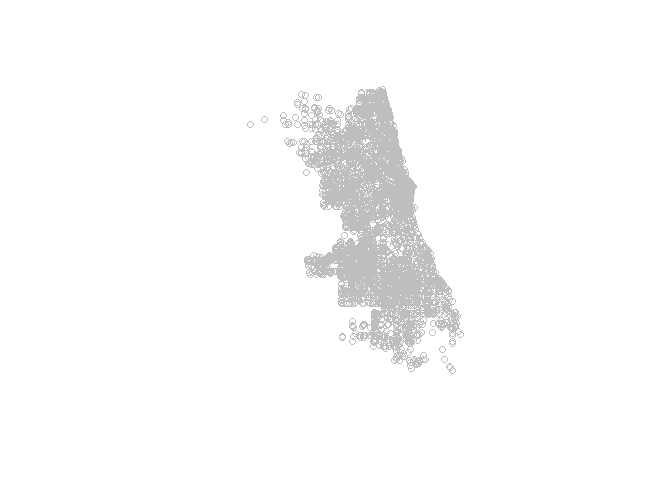

So far so good, now it would be useful to have some roads. The `RSocrata` package isn't able to download and open zipfiles with spatial data so this step has to be done manually.

Loading and tweaking the spatial layers
=======================================

We need to project these to the map projection preferred by the Chicago authorities converting the coordinates into meters. This makes things much easier when we come to analysis and plotting alongside the road network. Go to *Major Streets* data page <https://data.cityofchicago.org/Transportation/Major-Streets/ueqs-5wr6> and download the zipfile. Extract the contents (this should be 5 files) into your working directory folder. These files contain the spatial data for major streets in Chicago. We can load them into R using the `read_sf` function.

``` r
Roads <- read_sf("Major_Streets.shp") # downloaded from https://data.cityofchicago.org/Transportation/Major-Streets/ueqs-5wr6

#Simplify to 1km

Roads <- st_simplify(Roads, 1000)

#Plot these (may take a few seconds)
plot(Roads$geometry)

#We can also overlay the accident data
plot(bad_drive_sf$geometry, col="yellow", add=T, pch=16)
```

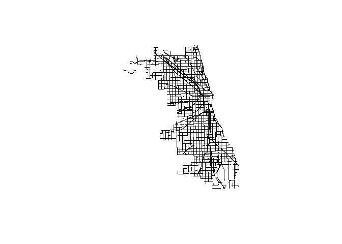

In this plot R is doing us a favor by working out that the two data layers are in fact using different projection systems and reprojecting to a common system before plotting in order that they align. This is fine for plotting but for analysis it is best to have them sharing a projection system, in this case the projection specific to Chicago (<https://epsg.io/102671>).

``` r
#The roads have been loaded into R with the projection information we need. You can see it as follows:
st_crs(Roads)
```

    ## Coordinate Reference System:
    ##   No EPSG code
    ##   proj4string: "+proj=tmerc +lat_0=36.66666666666666 +lon_0=-88.33333333333333 +k=0.9999749999999999 +x_0=300000 +y_0=0 +datum=NAD83 +units=us-ft +no_defs"

``` r
#We can take that information and use it to reproject the points layer containing the accident data.
bad_drive_sf<- st_transform(bad_drive_sf,st_crs(Roads)$proj4string)

#Check the projections now match
st_crs(Roads)
```

    ## Coordinate Reference System:
    ##   No EPSG code
    ##   proj4string: "+proj=tmerc +lat_0=36.66666666666666 +lon_0=-88.33333333333333 +k=0.9999749999999999 +x_0=300000 +y_0=0 +datum=NAD83 +units=us-ft +no_defs"

``` r
st_crs(bad_drive_sf)
```

    ## Coordinate Reference System:
    ##   No EPSG code
    ##   proj4string: "+proj=tmerc +lat_0=36.66666666666666 +lon_0=-88.33333333333333 +k=0.9999749999999999 +x_0=300000 +y_0=0 +ellps=GRS80 +towgs84=0,0,0,0,0,0,0 +units=us-ft +no_defs"

Exploratory plots with ggplot2
==============================

We now start to explore different approaches to plotting the data using `ggplot2`. The real power of the package comes from its ability to quickly create different graphical outputs from minimal tweaks to the code. For example we can pipe in our coordinates data to produce a simple point map:

``` r
bad_drive_sf %>%
  st_coordinates %>%
  data.frame %>%
  ggplot(aes(X,Y)) +
  geom_point() +
  mapTheme()
```

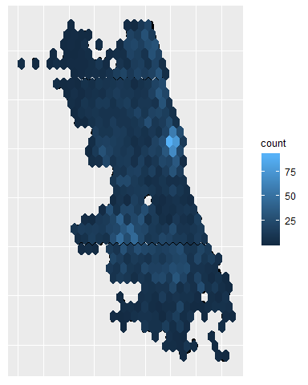

Then add the `geom_hex` syntax to create a hexagonal binning map. This can be tweaked with the `bins=` parameter to adjust the bin size.

``` r
bad_drive_sf %>%
  st_coordinates %>%
  data.frame %>%
  ggplot(aes(X,Y)) +
  geom_point() +
  geom_hex() +
  mapTheme()
```

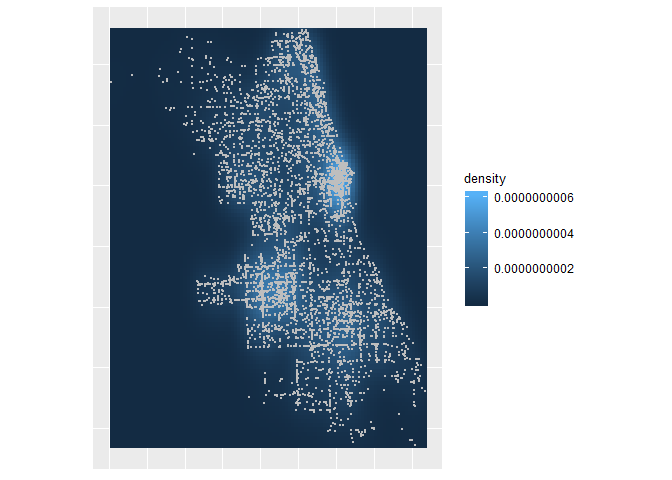

Or it's possible to create a point density map with the `geom_density_2d` syntax.

``` r
bad_drive_sf %>%
  st_coordinates %>%
  data.frame %>%
  ggplot(aes(X,Y)) +
  geom_point() +
  geom_density_2d() +
  mapTheme()
```

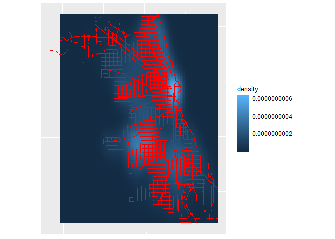

What's more we can group the piped steps together into a single object and then add extra geoms - this can make things easier if we are tweaking complex plots.

``` r
#Its also possible to group the piped steps together into a single object
Density <- bad_drive_sf %>%
  st_coordinates %>%
  data.frame %>%
  ggplot(aes(X,Y)) +
  stat_density_2d(geom = "raster", aes(fill = stat(density)), contour = FALSE) +
  coord_equal() +
  mapTheme()

#This has the advantage of being much easier to add further layers to, such as points
Density + geom_point(size=0.5, color="grey")
```

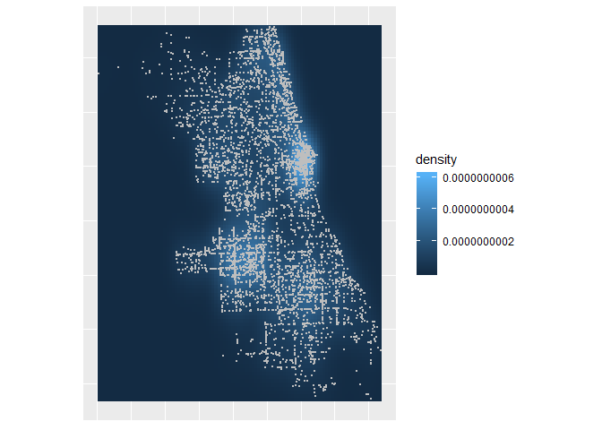

The plots created so far are all using the source object for their data. If we break the ggplot code down a little further it is possible to layer the plots using different data sources with the `data=` parameter within each geom.

``` r
Bad_drive_pts<- bad_drive_sf %>% st_coordinates %>% data.frame

ggplot() +
  stat_density_2d(data=Bad_drive_pts, aes(X, Y, fill = stat(density)),
                  geom = "raster", contour = FALSE) +
  geom_sf(data=Roads, color="red", alpha=0.5) +
  mapTheme()
```

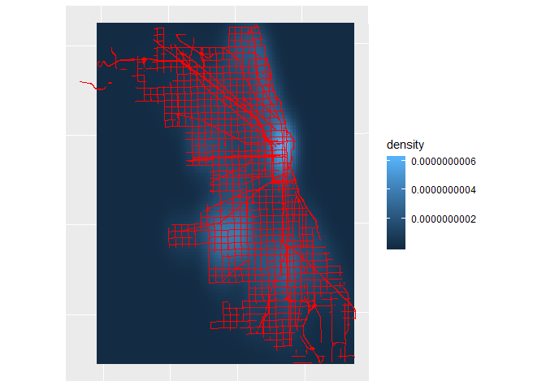

This is a particulary useful feature for maps since these usually comprise a series of basemap layers with the data overlain on top. In Chicago's case bodies of water are really important.

``` r
Water<- read_sf("Water_Clip.shp") #adapted from https://data.cityofchicago.org/Parks-Recreation/Waterways/eg9f-z3t6

#Need to reproject to the correct projection
Water <- st_transform(Water,st_crs(Roads)$proj4string)

#Add as additional layer

ggplot() +
  stat_density_2d(data=Bad_drive_pts, aes(X, Y, fill = stat(density)),
                  geom = "raster", contour = FALSE) +
  geom_sf(data=Water, color=NA, fill="blue") +
  geom_sf(data=Roads, color="red", alpha=0.5) +
  mapTheme()
```

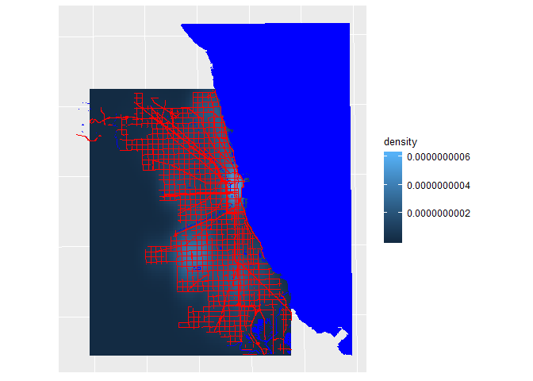

Hopefully the preceding steps give a good indication of how spatial data can be layered using ggplot. The final part of this worksheet looks at how we can add an extra analytical step to produce a more informative map. In this case we are going to assign the accidents to the nodes in the road network to show the stretches of road that have the most accidents along them.

A little more analysis
======================

To do this the roads need to be broken into their respective nodes. `group_by` ensures the object ID of each road node is preserved, this will be useful shortly and `st_cast` is the function that extracts the coordinates.

``` r
Road_nodes_sf<-Roads %>% group_by(OBJECTID) %>%  st_cast("POINT")

Road_nodes_df<-data.frame(st_coordinates(Road_nodes_sf), Road_nodes_sf$OBJECTID)
names(Road_nodes_df)<- c("X", "Y", "ID")
Road_nodes_df$Seg<- 1:nrow(Road_nodes_df)
```

Now we make use of the `nn2` function from the `RANN` package. This a trick I learned from this useful blog post: <https://www.gis-blog.com/nearest-neighbour-search-for-spatial-points-in-r/>.

I'm not going to go into detail about how the `nn2` function works, but I will say that it assigns the nearest points (the traffic accidents) to another set of points (the road nodes) by searching within a radius. The result from the code below is a data frame containing the accidents and their nearest road node. From there we can rejoin them to the full road network and sum the number of accidents at each node.

*Note here that we have only got the major roads in Chicago, not the full network, so a lot of the accidents will not be assigned to a road node if they were more than 1km away. This is clearly an arbitrary and very high threshold but one that works well for the map.*

``` r
#Perform the nearest neighbor search. The k parameter is the number of near neighbours required (1 in this case) and the radius is the distance (in this case in meters that the search around each point should take place within).
closest <- data.frame(nn2(st_coordinates(bad_drive_sf), Road_nodes_df[,1:2], k = 1, searchtype = "radius", radius = 1000))

#Merge the output to the Road_nodes_df object.

Accident_Dist<-merge(closest,Road_nodes_df, by.x="nn.idx", by.y="Seg")

#Create a count column and then sum to give total accidents per road node

Accident_Dist$Count<-1

Segsums<- aggregate(Accident_Dist$Count, by=list(Accident_Dist$ID), FUN="sum")

names(Segsums)<- c("ID", "Sum")

#Merge this back to the Road nodes

final<- merge(Road_nodes_df,Segsums, by="ID", all.x=T)
```

The result of these steps should be a dataframe (note that this no longer a spatial or `sf` object) comprising and ID for each stretch of road, its X and Y coordinate, a number for the segment/ node and the sum of accidents. If you take a look at the first few rows you'll spot a lot of NAs. These are parts of the network where there hasn't been an accident. We don't want to lose these, but nor do we want them to be a number &gt; 1, implying an accident has occurred. We can therefore assign them a value 0.1.

``` r
final[is.na(final)] <- 0.1
```

Now we're ready to plot using the `geom_path` option. Each segment can be sized according to the accidents occurring along it.

``` r
ggplot(final, aes(X,Y,group=ID, order=Seg,size=Sum)) +
  geom_path() +
  scale_size(range=c(0.2,5)) +
  coord_equal() +
  mapTheme()
```

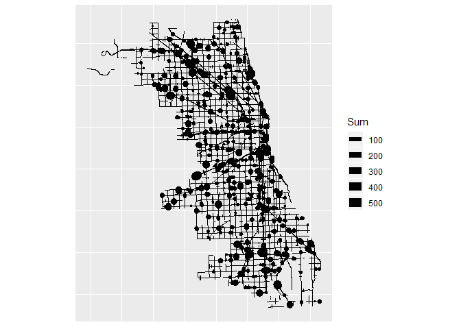

We can now revisit some of the code created earlier to recreate a plot with these scaled roads instead of points.

``` r
ggplot() +
  stat_density_2d(data=Bad_drive_pts, aes(X, Y, fill = stat(density)),
                  geom = "raster", contour = FALSE) +
  geom_sf(data=Water, color=NA, fill="blue") +
  geom_path(data=final,aes(X,Y,group=ID, size=Sum)) +
  scale_size(range=c(0.2,3)) +
  mapTheme()
```

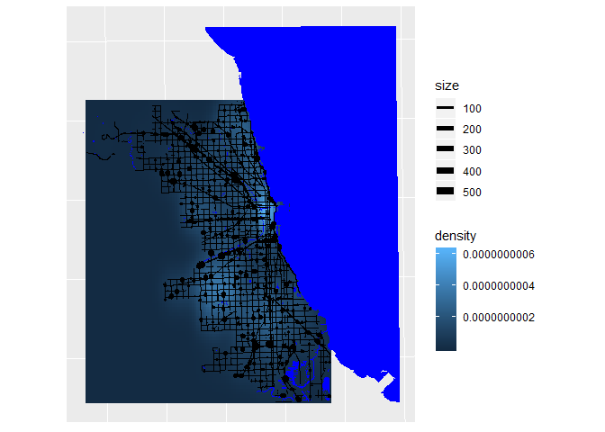

It isn't the most visually appealing map, but it has the raw materials we need to create something a little more compelling.

The final map
=============

I give each new piece of code its own line.

``` r
#First zoom in to the central part of the city by limiting the extent of the plot by giving a bounding box.
ggplot() +
  stat_density_2d(data=Bad_drive_pts, aes(X, Y, fill = stat(density)),
                  geom = "raster", contour = FALSE) +
  geom_sf(data=Water, color=NA, fill="blue") +
  geom_path(data=final,aes(X,Y,group=ID, size=Sum)) +
  scale_size(range=c(0.2,3)) +
  xlim(1145000,1200000) +
  ylim(1850000,1925000) +
  mapTheme()
```

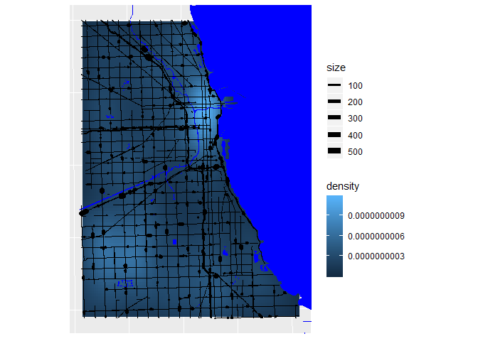

``` r
#Next we can focus on the colours of the density. Rather than show a raster image we can use filled contors and the scale_fill_contious option

ggplot() +
  stat_density_2d(data=Bad_drive_pts, aes(X, Y,fill = stat(level)), geom = "polygon") +
  scale_fill_continuous(low="white", high="purple") +
  geom_sf(data=Water, color=NA, fill="blue") +
  geom_path(data=final,aes(X,Y,group=ID,size=Sum)) +
  scale_size(range=c(0.2,3)) +
  xlim(1145000,1200000) +
  ylim(1850000,1925000) +
  mapTheme()
```

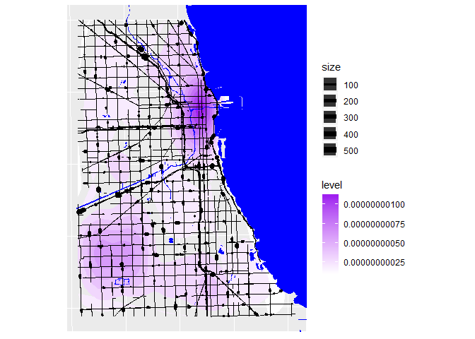

``` r
#Now it's time to use a subtler color for the water with a slight outline

ggplot() +
  stat_density_2d(data=Bad_drive_pts, aes(X, Y,fill = stat(level)), geom = "polygon") +
  scale_fill_continuous(low="white", high="purple") +
  geom_sf(data=Water, color="azure4", fill="azure3", size=0.1) +
  geom_path(data=final,aes(X,Y,group=ID, size=Sum)) +
  scale_size(range=c(0.2,3)) +
  xlim(1145000,1200000) +
  ylim(1850000,1925000) +
  mapTheme()
```

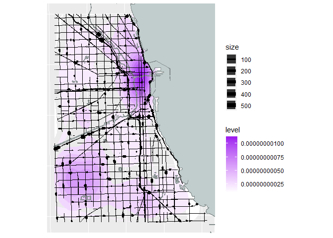

``` r
#Getting there! The road line widths look a bit weird - they can appear as "T" shapes if they are short segments and/or the plot size is small. Tweak the scale_size parameter to minimise this.

ggplot() +
  stat_density_2d(data=Bad_drive_pts, aes(X, Y,fill = stat(level)), geom = "polygon") +
  scale_fill_continuous(low="white", high="purple") +
  geom_sf(data=Water, color="azure4", fill="azure3",size=0.1) +
  geom_path(data=final,aes(X,Y,group=ID, size=Sum)) +
  scale_size(range=c(0.2,2)) +
  xlim(1145000,1200000) +
  ylim(1850000,1925000) +
  mapTheme()
```

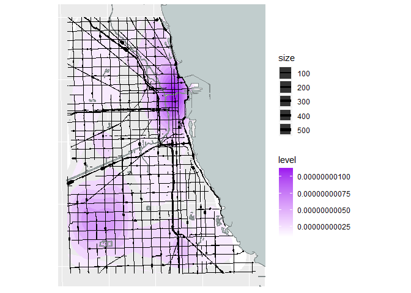

``` r
#If the line width isn't working out then the segments could be coloured as well.

ggplot() +
  stat_density_2d(data=Bad_drive_pts, aes(X, Y,fill = stat(level)), geom = "polygon") +
  scale_fill_continuous(low="white", high="purple") +
  geom_sf(data=Water, color="azure4", fill="azure3", size=0.1) +
  geom_path(data=final,aes(X,Y,group=ID, color=Sum), size=0.5) +
  scale_color_continuous(low="black", high="darkorange") +
  xlim(1145000,1200000) +
  ylim(1850000,1925000) +
  mapTheme()
```

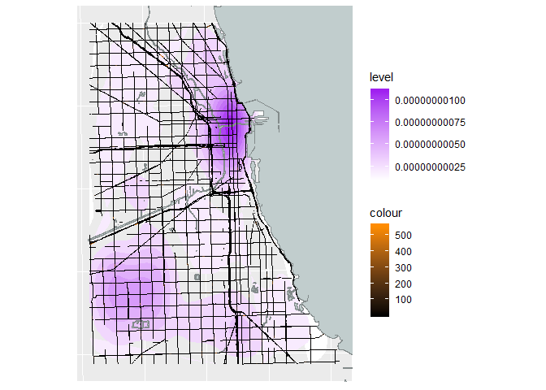

``` r
#Finally we can tidy up the plot window and add a title

ggplot() +
  stat_density_2d(data=Bad_drive_pts, aes(X, Y,fill = stat(level)), geom = "polygon") +
  scale_fill_continuous(low="white", high="purple", name = "Density of\naccidents") +
  geom_sf(data=Water, color="azure4", fill="azure3", size=0.1) +
  geom_path(data=final,aes(X,Y,group=ID, color=Sum, size=Sum)) +
  scale_color_continuous(low="cornsilk4", high="darkorange", name = "Number of\naccidents") +
  scale_size(range=c(0.2,2), guide = "none") +
  xlim(1145000,1200000) +
  ylim(1850000,1925000) +
  coord_sf(datum=NA) +
  ggtitle("Bad Drivers in Chicago") +
  geom_label(aes(x = 1166000,
                 y = 1850000,
                 label = "Data Source: data.cityofchicago.org; Created by: James Cheshire"),
             fill="white") +
  mapTheme()
```

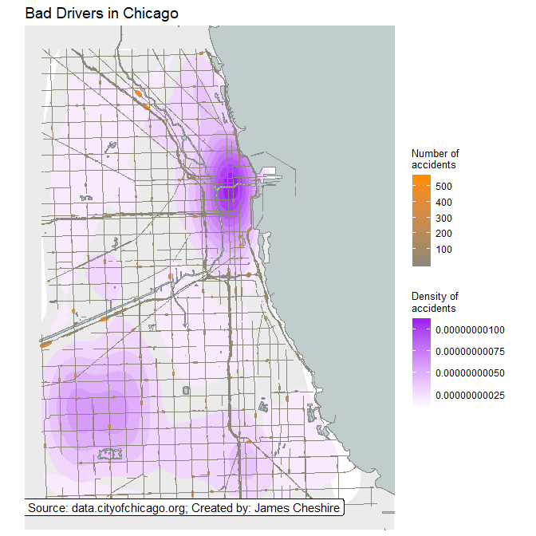

``` r
#Save a pdf of the map to your working directory
ggsave("chicago_accidents.pdf")
```

That's it!

This is clearly the beginning, and there are many other possibilities both in terms of customization of the map with ggplot, but also with the additional data and layers that can be accessed. I hope that this masterclass has offered a useful starting point!

Socrata data for replication
============================

Below are a few datasets that can be used to replicate the above analysis:

1.  Crash data from 1997 to Current from Pennsylvania Department of Transportation. Available [here](https://data.pa.gov/Public-Safety/Crash-Data-1997-to-Current-Transportation/dc5b-gebx)
2.  Crashes in Cincinnati, Ohio. Available [here](https://data.cincinnati-oh.gov/Safer-Streets/Traffic-Crash-Reports-CPD-/rvmt-pkmq)
3.  Traffic crashes from 2011 to 2016 in Detroit. Available [here](https://data.detroitmi.gov/Transportation/Traffic-Crashes/9fph-m2jv)

About the Author
================

*James Cheshire is an Associate Professor at the UCL Department of Geography. He is co-author of two best-selling books entitled London: The Information Capital and Where the Animals Go.*
